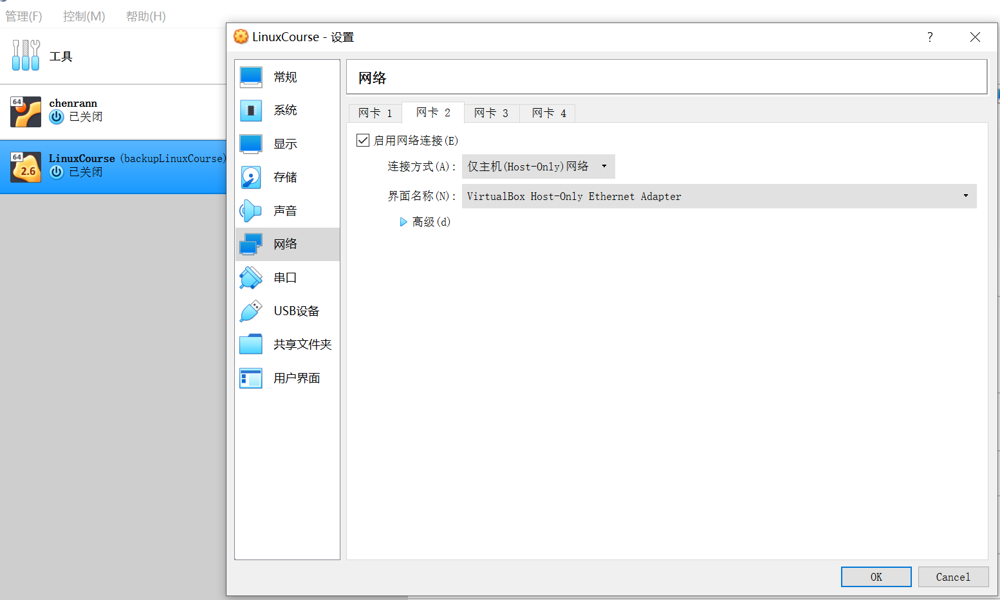
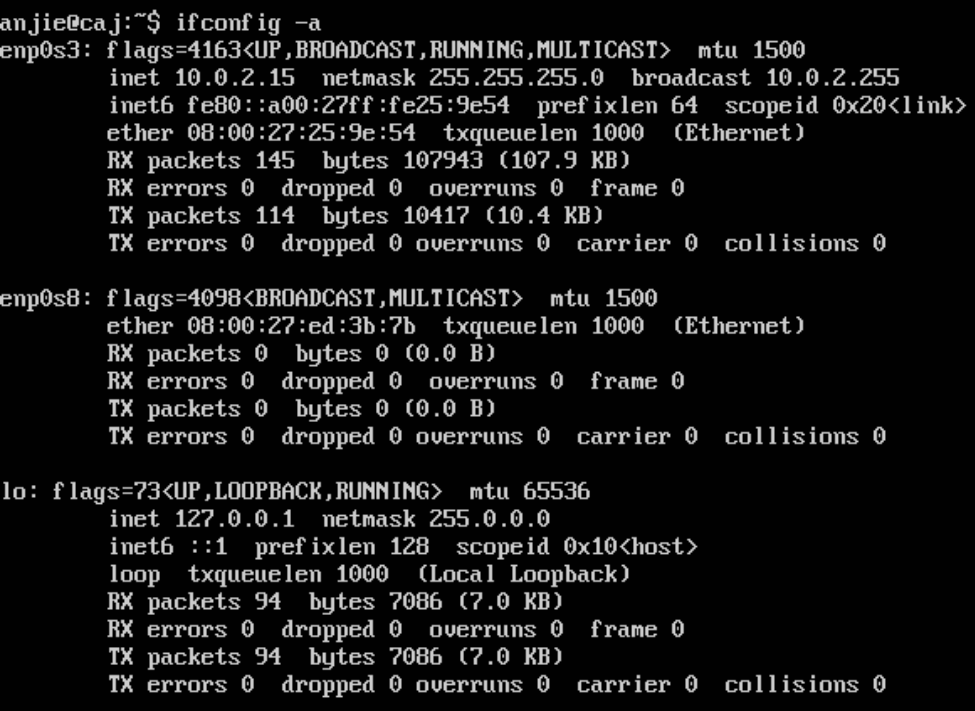
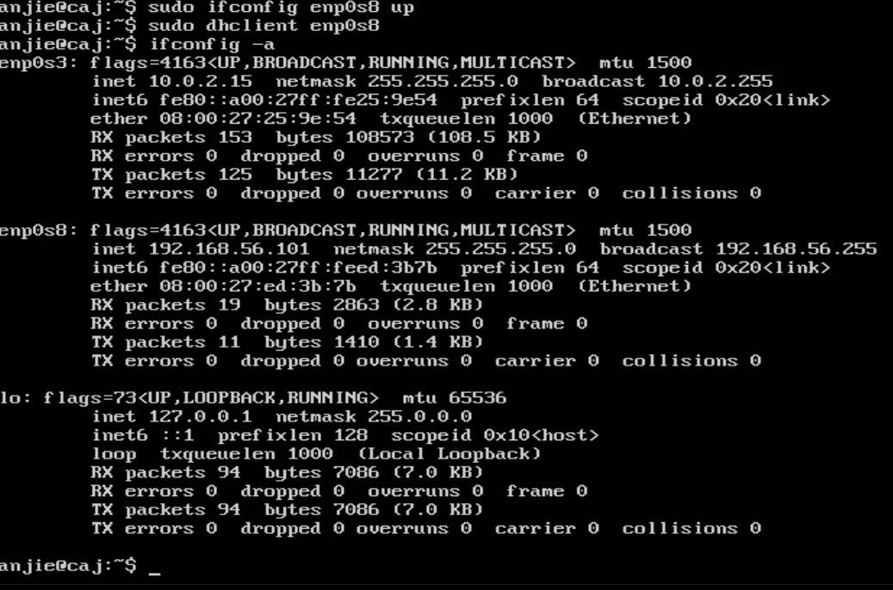
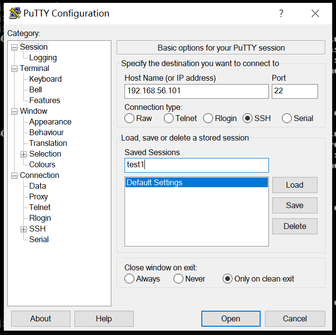
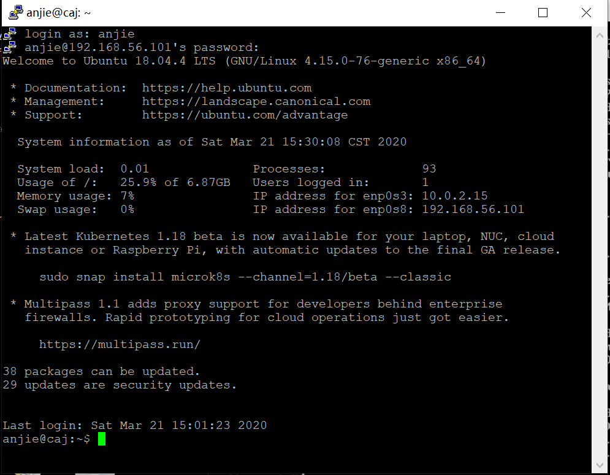
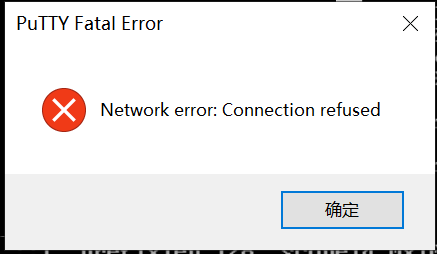
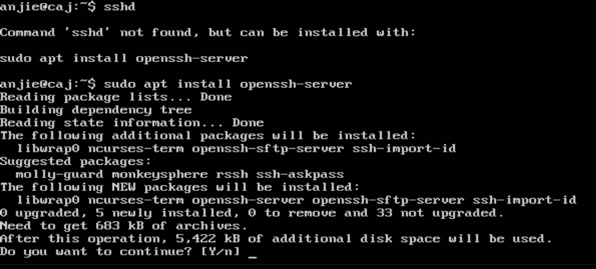

## 环境： 
#### Windows10  
#### VirtualBox 6.0 
#### Ubuntu 18.04.4 Server 64bit
***  
## 主要参考资料
[黄老师课件](https://github.com/c4pr1c3/LinuxSysAdmin)  
[无人值守Linux安装镜像制作](https://blog.csdn.net/qq_31989521/article/details/58600426)
***

## 一、如何使用sftp在虚拟机和宿主机之间传输文件？&  Virtualbox安装完Ubuntu之后新添加的网卡如何实现系统开机自动启用和自动获取IP ？

### 实现过程：
#### 1、官网下载PuTTY(64-bit)  
#### 2、设置网卡2，连接方式为Host-Only, 如图  
  
#### 3、启动虚拟机ubuntu-server-18.04.4
#### 4、ubuntu命令行输入命令 `ifconfig -a`查看网卡状态, 如图  
  
#### 5、发现有网卡enp0s8未启动, 使用命令`sudo ifconfig enp0s8 up
#### sudo dhclient enp0s8`手动启动，得到IP: 192.168.56.101如图
  
#### 6、用PuTTY连接ubuntu，如图  
  

#### 7、将镜像文件ubuntu-18.04.4-server-amd64.iso用psftp从Windows复制到
#### ubuntu的~/，命令`put ubuntu-18.04.01-server-amd64.iso`如图  

***
### 遇到的问题**P** 和解决办法**S**（附参考资料链接**R**）
***
#### **P**: putty连接时出现fatal error: connection refused, 如图  
   
#### **S**:在unbuntu安装SSHD服务, 如图  
  
#### **R**: [PuTTY连接虚拟机linux——connection refused问题](https://blog.csdn.net/gsycwh/article/details/79051799?depth_1-utm_source=distribute.pc_relevant.none-task&utm_source=distribute.pc_relevant.none-task)
***
#### **P**： 文件传输失败 `unable to open`, 如图  
   
#### **S**:  直接打开psftp.exe输入命令，传输成功
#### **R**: [无人值守Linux安装镜像制作](https://blog.csdn.net/qq_31989521/article/details/58600426)

***

## 二、如何配置无人值守安装iso并在Virtualbox中完成自动化安装。
### 实现过程
#### 在当前用户目录下（/home/cuc）创建一个用于挂载iso镜像文件的目录
`mkdir loopdir`  
#### 挂载iso镜像文件到该目录  
`mount -o loop ubuntu-16.04.1-server-amd64.iso loopdir`
#### 创建一个工作目录用于克隆光盘内容  
`mkdir clone`  
#### 同步光盘内容到目标工作目录  
`rsync -av loopdir/ clone`
#### 卸载iso镜像  
umount loopdir  
#### 进入目标工作目录  
`cd clone/`  
#### 编辑Ubuntu安装引导界面增加一个新菜单项入口  
`vim isolinux/txt.cfg`  
##### 添加以下内容到该文件后强制保存退出
label autoinstall
  menu label ^Auto Install Ubuntu Server
  kernel /install/vmlinuz
  append  file=/cdrom/preseed/ubuntu-server-autoinstall.seed debian-installer/locale=en_US console-setup/layoutcode=us keyboard-configuration/layoutcode=us console-setup/ask_detect=false localechooser/translation/warn-light=true localechooser/translation/warn-severe=true
  initrd=/install/initrd.gz root=/dev/ram rw quiet

#### 将Ubuntu官方文档preseed.cfg从宿主机Windows复制到虚拟机，并保存到新创建的工作目录~/cd/preseed/ubuntu-server-autoinstall.seed  
#### 修改isolinux/isolinux.cfg，增加内容timeout 10  
#### 重新生成md5sum.txt（用root登陆）
`cd /home/cuc/cd && find . -type f -print0 | xargs -0 md5sum > md5sum.txt`  
#### 封闭改动后的目录到.iso
IMAGE=custom.iso
BUILD=/home/cuc/cd/
安装genisoimage `sudo apt install genisoimage`
mkisofs -r -V "Custom Ubuntu Install CD" \
            -cache-inodes \
            -J -l -b isolinux/isolinux.bin \
            -c isolinux/boot.cat -no-emul-boot \
            -boot-load-size 4 -boot-info-table \
            -o $IMAGE $BUILD 
#### 查看~/clone下制作好的custom.iso 
  
#### 在windows打开psftp窗口, 执行`get custom.iso`, 从虚拟机中将custom.iso这个镜像文件复制出来
***
### 遇到的问题**P** 和解决办法**S**（附参考资料链接**R**）   
***
**P**: 经常遇到命令执行不了的情况, 如图  
  

**S**: 用root权限执行该命令，`sudo` or `sudo su`执行     
***
**P**: vim编辑保存时出现错误，如图  
  
**S**: 加！  
**R**:[Linux：readonly option is set (add ! to override)错误](https://blog.csdn.net/weixin_40853073/article/details/81707177)
***
**P**: `mkisofs`经常出现问题，各不相同，举例如图  
 
    
   
 
  
**S**: 学习查阅mkisofs命令, 修改命令成功  
 
**R**: [mkisofs命令制作iso文件](https://blog.csdn.net/halazi100/article/details/45601239)

