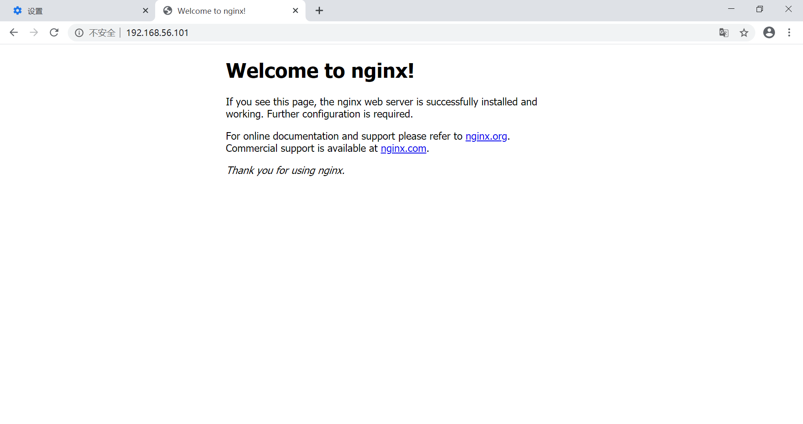
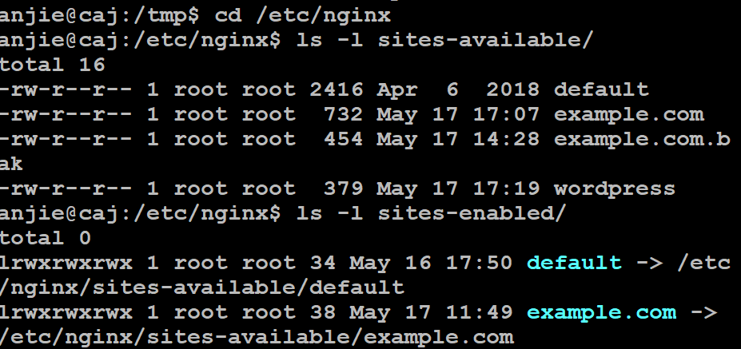

## chap5：web服务器（实验）

### 实验环境
- 宿主机Windows10 虚拟机Ubuntu 18.04
- nginx/1.14.0 (Ubuntu)
- VeryNginx
- Wordpress 4.7
- DVWA

### 主要参考资料
[How To Create a Self-Signed SSL Certificate for Nginx in Ubuntu 18.04](https://www.digitalocean.com/community/tutorials/how-to-install-wordpress-with-lemp-on-ubuntu-18-04)  
[How To Install Linux, Nginx, MySQL, PHP (LEMP stack) on Ubuntu 18.04](https://www.digitalocean.com/community/tutorials/how-to-install-linux-nginx-mysql-php-lemp-stack-ubuntu-18-04)  
[How To Install WordPress with LEMP on Ubuntu 18.04](https://www.digitalocean.com/community/tutorials/how-to-create-a-self-signed-ssl-certificate-for-nginx-in-ubuntu-18-04)  
[DVWA Source control](https://github.com/ethicalhack3r/DVWA)
[VeryNignx](https://github.com/alexazhou/VeryNginx)    
[How to Install and Configure DVWA Lab on Ubuntu 18.04 server](https://kifarunix.com/how-to-setup-damn-vulnerable-web-app-lab-on-ubuntu-18-04-server/2/)
[老师第五章FAQ 哔哩哔哩](https://m.bilibili.com/video/BV1de411p7Vq)   
[老师第五章课件](https://c4pr1c3.github.io/LinuxSysAdmin/chap0x05.exp.md.html#)
[2019-linux 作业](https://github.com/CUCCS/)
### 基本要求
- 在一台主机（虚拟机）上同时配置Nginx和VeryNginx 
- VeryNginx作为本次实验的Web App的反向代理服务器和WAF
- PHP-FPM进程的反向代理配置在nginx服务器上，VeryNginx服务器不直接配置Web站点服务
- 使用Wordpress搭建的站点对外提供访问的地址为： http://wp.sec.cuc.edu.cn
- 使用Damn Vulnerable Web Application (DVWA)搭建的站点对外提供访问的地址为： http://dvwa.sec.cuc.edu.cn

### 安全加固要求
- 使用IP地址方式均无法访问上述任意站点，并向访客展示自定义的友好错误提示信息页面-1
- Damn Vulnerable Web Application (DVWA)只允许白名单上的访客来源IP，其他来源的IP访问均向访客展示自定义的友好错误提示信息页面-2
- 在不升级Wordpress版本的情况下，通过定制VeryNginx的访问控制策略规则，热修复WordPress < 4.7.1 - Username Enumeration
- 通过配置VeryNginx的Filter规则实现对Damn Vulnerable Web Application (DVWA)的SQL注入实验在低安全等级条件下进行防护

### VeryNginx配置要求
- VeryNginx的Web管理页面仅允许白名单上的访客来源IP，其他来源的IP访问均向访客展示自定义的友好错误提示信息页面-3
- 通过定制VeryNginx的访问控制策略规则实现： 
- 限制DVWA站点的单IP访问速率为每秒请求数 < 50
- 限制Wordpress站点的单IP访问速率为每秒请求数 < 20
- 超过访问频率限制的请求直接返回自定义错误提示信息页面-4
- 禁止curl访问

### 大致安装流程 
#### Nginx 1.14.0
- 安装：`sudo apt install nginx`  
- 修改配置文件：sudo vim /etc/nginx/sites-available/default，设置默认端口为80

#### 此处省略MYSQL和PHP的安装，详见参考资料

#### Wordpress
- 安装  
4.7版本的下载链接详见[老师课件提供的](https://c4pr1c3.github.io/LinuxSysAdmin/chap0x05.exp.md.html#/1/1)
导入，解压，复制wordpress文件夹到常用工作目录底下，创建软连接  
`sudo ln -s /etc/nginx/sites-available/wp-conf /etc/nginx/sites-enabled/`
- 拷贝一份default配置文件，根据它修改成Wordpress的配置文件


#### VeryNginx
- 安装
```
sudo apt update

sudo apt install git

git config --global user.name "Your Name"

git config --global user.email "youremail@domain.com"

git clone https://github.com/alexazhou/VeryNginx.git

cd VeryNginx

sudo apt install libssl1.0-dev libpcre3 libpcre3-dev build-essential

python3 install.py install

sudo adduser nginx

sudo /opt/verynginx/openresty/nginx/sbin/nginx

ps aux | grep nginx

sudo netstat -anop | grep nginx

浏览器：192.168.56.101/verynginx/index.html
用户名及密码：
```
- 修改配置文件：/opt/verynginx/openresty/nginx/conf/nginx.conf
```
将server模块监听端口改为8087

加入：
ssl_certificate /etc/ssl/nginx-selfsigned.crt;
ssl_certificate_key /etc/ssl/nginx-selfsigned.key;
```
### 实验过程
1. 基本要求实现
- 修改nginx的wordpress-http配置：设置监听端口为127.0.0.1:8080；添加配置块，配置wordpress-https，设置监听端口为127.0.0.1:4433
- 修改verynginx的nginx.conf配置文件,分别监听443和80端口
- 配置verynginx端口转发：配置matcher；配置Up Stream；配置Proxy Pass 

- 修改nginx的DVWA-http配置：设置监听端口为127.0.0.1:8081
- 配置verynginx端口转发；配置matcher；配置Up Stream；配置Proxy Pass 
- 更改windows10的hosts配置文件 

2. 安全加固要求

### 出现的问题

1. 浏览器输入http://192.168.56.101没有默认nginx welcome页面显示   
solution：网络连接按层排查。虚拟机宿主机`ping http://192.168.56.101`, 检查网络层的连接，成功，还证明了网络层以下连接也成功；  
虚拟机宿主机`curl http://192.168.56.101`, 检查传输层的连接，成功。打开chrome浏览器，恢复默认设置，取消代理，
显示页面成功。


2. 浏览器wordpress最后安装的页面打不开。
solution：检查/etc/nginx/sites_available 和 /etc/nginx/sites_enabled的文件夹`list -l sites-enabled/`，发现前者有wordpress，但是后者没有内容指向向前者,
`sudo ln -s /etc/nginx/sites-available/wordpress /etc/nginx/sites-enabled/`使得二者连接上

根据老师新发布的视频[老师第五章FAQ 哔哩哔哩](https://m.bilibili.com/video/BV1de411p7Vq)，
发现/etc/nginx/sites_available/wordpress配置文件有错，按照default配置改动的地方不足，重新按照讲解修改配置文件。

3. 启动VeryNginx报错显示文件不存在`-bash: /opt/verynginx/openresty/nginx/sbin/nginx: No
such file or dictionary`
solution: 找不到哪里出问题；于是删除所有VeryNginx的文件，重新安装VeryNginx, 成功了


