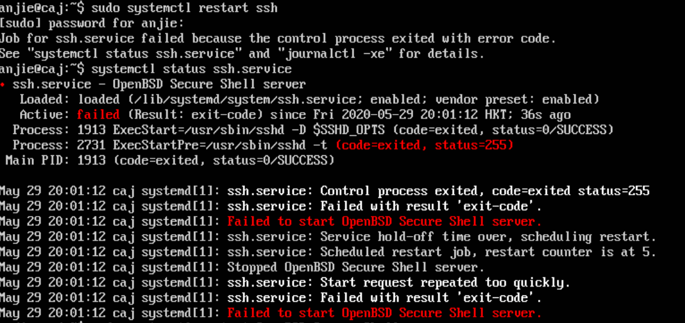

# 实验六：SHELL 脚本编程练习进阶

## 实验环境
- 复制一个和原来一样的虚拟机Ubuntu-server-18.04   
[VirtualBox复制虚拟机](https://www.cnblogs.com/shxdyz/articles/7920940.html)
- 工作主机192.168.56.102
- 目标主机192.168.56.101


## 工作主机免密登陆目标主机
- 在工作主机(192.168.56.102)生成ssh-key  
`ssh-keygen -f key0`
- 修改目标主机(192.168.56.101)/etc/ssh/sshd_config配置  
```
PasswordAuthentication yes  
PermitRootLogin yes
``` 
- 重启目标主机(server)SSH服务
`sudo systemctl restart ssh`
- 工作主机(client)导入ssh-key
`ssh-copy-id -i ~/key0 anjie@192.168.56.101`
- On the server :
`sudo passwd -l root`
- Edit /etc/ssh/sshd_config  
`sudo nano /etc/ssh/sshd_config`  
Change the following :
```
PasswordAuthentication no
PermitRootLogin without-password
```
- Restart the server
`sudo service ssh restart`

- 遇到的问题之一: ssh server restart failed

解决方案：重新排查配置文件/etc/ssh/sshd_config，发现password拼写错误(捂脸)  
参考：[ubuntu16.04 ssh启动报错Failed to start OpenBSD Secure Shell server.](https://www.jianshu.com/p/bf17f2f9722d)

- 遇到的问题之二：拷贝密钥报错  
`/usr/bin/ssh-copy-id: ERROR: failed to open ID file 'home/anjie/.ssh/key0.pub': No such file`  
不能完全照抄[How to set up passwordless SSH access to root user](https://askubuntu.com/questions/115151/how-to-set-up-passwordless-ssh-access-for-root-user)
文件路径不对，改成~/key0

## FTP(软件: vsftpd)
- 为什么选它？网上参考资料多
- 在工作主机上手动安装：[vsftpd的使用](https://blog.csdn.net/a735834365/article/details/80622105)  
[Ubuntu18.04中安装vsftpd服务](https://blog.csdn.net/sharpbladepan/article/details/80686690?utm_source=blogxgwz1)
- 通过工作主机运行脚本在目标主机安装vsftpd并完成相关配置 
```
# Config file /etc/vsftpd.conf

listen=NO
listen_ipv6=YES
anonymous_enable=YES
local_enable=YES
write_enable=YES
anon_upload_enable=NO
anon_mkdir_write_enable=NO
dirmessage_enable=YES

use_localtime=YES

xferlog_enable=YES

connect_from_port_20=YES

#chown_uploads=YES
#chown_username=whoever

chroot_local_user=YES

secure_chroot_dir=/var/run/vsftpd/empty

pam_service_name=vsftpd

rsa_cert_file=/etc/ssl/certs/ssl-cert-snakeoil.pem
rsa_private_key_file=/etc/ssl/private/ssl-cert-snakeoil.key
ssl_enable=NO

anon_root=/var/ftp
no_anon_password=YES
pasv_min_port=40000
pasv_max_port=50000
userlist_enable=YES
userlist_file=/etc/vsftpd.userlist
userlist_deny=NO
tcp_wrappers=YES
allow_writeable_chroot=YES
```
- 配置一个提供匿名访问的FTP服务器，匿名访问者可以访问1个目录且仅拥有该目录及其所有
子目录的只读访问权限  
- 配置一个支持用户名和密码方式访问的账号，该账号继承匿名访问者所有权限，且拥有对另1
个独立目录及其子目录完整读写（包括创建目录、修改文件、删除文件等）权限  
- FTP用户不能越权访问指定目录之外的任意其他目录和文件
- 在工作主机上再执行该脚本以验证幂等性  

## NFS
- 在工作主机上手动安装：[How To Set Up an NFS Mount on Ubuntu 18.04](https://www.digitalocean.com/community/tutorials/how-to-set-up-an-nfs-mount-on-ubuntu-18-04)
- 在1台Linux上配置NFS服务，另1台电脑上配置NFS客户端挂载2个权限不同的共享目录，
分别对应只读访问和读写访问权限
- 共享目录中文件、子目录的属主、权限信息 
- 在工作主机上再执行该脚本以验证幂等性  


## DHCP
- 在工作主机上手动安装：按照[Dynamic Host Configuration Protocol (DHCP)](https://help.ubuntu.com/community/isc-dhcp-server)  
```
# 其中配置工作主机、目标主机网卡内容:
# client:
network:
version: 2
renderer: networkd
ethernets:
    enp0s3:
        dhcp4: yes
    enp0s8:
        dhcp4: yes
    enp0s9:
        dhcp4: yes
# server:
network:
version: 2
renderer: networkd
ethernets:
    enp0s3:
        dhcp4: yes
    enp0s8:
        dhcp4: yes
    enp0s9:
        dhcp4: no
        addresses: [192.168.57.1/24]
```
```
# dhcpd.conf

option domain-name "example.org";

option domain-name-servers ns1.example.org, ns2.example.org;

default-lease-time 600;

max-lease-time 7200;

ddns-update-style none;

subnet 192.168.57.0 netmask 255.255.255.0 {
	range 192.168.57.150 192.168.57.200;
	default-lease-time 600;
	max-lease-time 7200;
}
```
- server上运行脚本
- 在工作主机上再执行该脚本以验证幂等性  


## DNS
- 手动安装：[Ubuntu Server Guide](https://ubuntu.com/server/docs)  [lujy](https://github.com/CUCCS/2015-linux-public-JuliBeacon/blob/614c2b31ca9306043bdd7fedd0d318cc9ed44e95/实验%206/实验6.md)
[How To Configure BIND as a Private Network DNS Server on Ubuntu 14.04](https://www.digitalocean.com/community/tutorials/how-to-configure-bind-as-a-private-network-dns-server-on-ubuntu-14-04#prerequisites)
```
# server: 

# 安装Bind 
sudo apt-get install bind9

# 修改配置文件options 
sudo vim /etc/bind/named.conf.options

# 添加如下配置
listen-on { 192.168.56.1; };
allow-transfer { none; };
forwarders {
    8.8.8.8;
    8.8.4.4;
};

# 编辑配置文件named.conf.local 
sudo vim /etc/bind/named.conf.local

# 添加如下配置
zone "cuc.edu.cn" {
    type master;
    file "/etc/bind/db.cuc.edu.cn";
};

# 生成配置文件db.cuc.edu.cn 
sudo cp /etc/bind/db.local /etc/bind/db.cuc.edu.cn

# client:

# 安装resolvconf 
sudo apt-get update && sudo apt-get install resolvconf

# 修改配置文件 
sudo vim /etc/resolvconf/resolv.conf.d/head

# 增加配置
search cuc.edu.cn
nameserver 192.168.56.1
```

