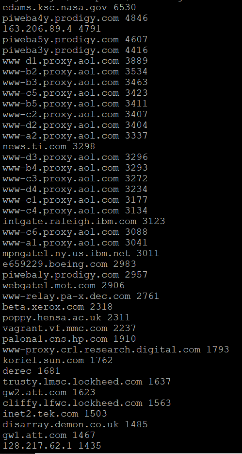
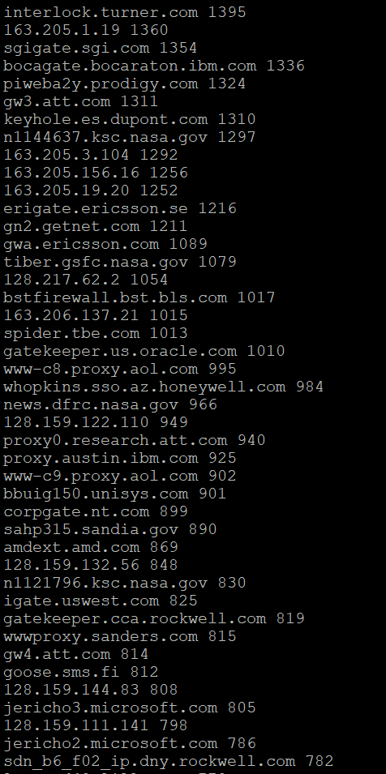
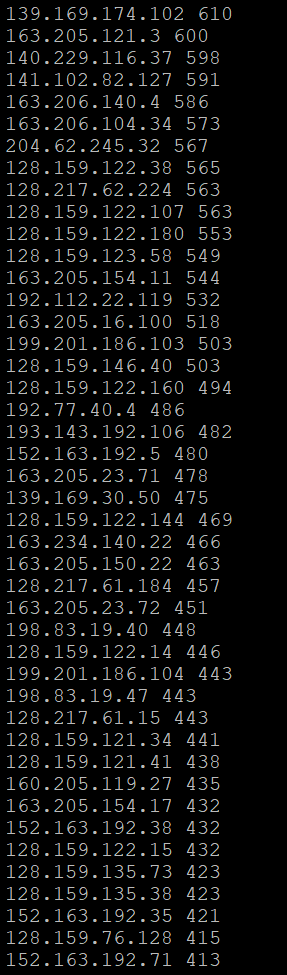

## 实验任务二：用bash编写一个文本批处理脚本，对以下附件分别进行批量处理完成相应的数据统计任务： 
#### 2014世界杯运动员数据 
√ 统计不同年龄区间范围（20岁以下、[20-30]、30岁以上）的球员数量、百分比  
√ 统计不同场上位置的球员数量、百分比  
√ 名字最长的球员是谁？名字最短的球员是谁？  
√ 年龄最大的球员是谁？年龄最小的球员是谁？

## 实验任务三：用bash编写一个文本批处理脚本，对以下附件分别进行批量处理完成相应的数据统计任务： 
#### Web服务器访问日志 
√ 统计访问来源主机TOP 100 IP和分别对应出现的总次数 

 
√ 统计访问来源主机TOP 100和分别对应出现的总次数 
edams.ksc.nasa.gov 6530  
piweba4y.prodigy.com 4846  
163.206.89.4 4791  
piweba5y.prodigy.com 4607  
piweba3y.prodigy.com 4416  
www-d1.proxy.aol.com 3889  
www-b2.proxy.aol.com 3534  
www-b3.proxy.aol.com 3463  
www-c5.proxy.aol.com 3423  
www-b5.proxy.aol.com 3411  
www-c2.proxy.aol.com 3407  
www-d2.proxy.aol.com 3404  
www-a2.proxy.aol.com 3337  
news.ti.com 3298  
www-d3.proxy.aol.com 3296  
www-b4.proxy.aol.com 3293  
www-c3.proxy.aol.com 3272  
www-d4.proxy.aol.com 3234  
www-c1.proxy.aol.com 3177  
www-c4.proxy.aol.com 3134  
intgate.raleigh.ibm.com 3123  
www-c6.proxy.aol.com 3088  
www-a1.proxy.aol.com 3041  
mpngate1.ny.us.ibm.net 3011  
e659229.boeing.com 2983  
piweba1y.prodigy.com 2957  
webgate1.mot.com 2906  
www-relay.pa-x.dec.com 2761  
beta.xerox.com 2318  
poppy.hensa.ac.uk 2311  
vagrant.vf.mmc.com 2237  
palona1.cns.hp.com 1910  
www-proxy.crl.research.digital.com 1793  
koriel.sun.com 1762  
derec 1681  
trusty.lmsc.lockheed.com 1637  
gw2.att.com 1623  
cliffy.lfwc.lockheed.com 1563  
inet2.tek.com 1503  
disarray.demon.co.uk 1485  
gw1.att.com 1467  
128.217.62.1 1435  
interlock.turner.com 1395  
163.205.1.19 1360  
sgigate.sgi.com 1354  
bocagate.bocaraton.ibm.com 1336  
piweba2y.prodigy.com 1324  
gw3.att.com 1311  
keyhole.es.dupont.com 1310  
n1144637.ksc.nasa.gov 1297   
163.205.3.104 1292  
163.205.156.16 1256  
163.205.19.20 1252  
erigate.ericsson.se 1216  
gn2.getnet.com 1211  
gwa.ericsson.com 1089  
tiber.gsfc.nasa.gov 1079  
128.217.62.2 1054  
bstfirewall.bst.bls.com 1017  
163.206.137.21 1015  
spider.tbe.com 1013  
gatekeeper.us.oracle.com 1010  
www-c8.proxy.aol.com 995  
whopkins.sso.az.honeywell.com 984  
news.dfrc.nasa.gov 966  
128.159.122.110 949  
proxy0.research.att.com 940  
proxy.austin.ibm.com 925  
www-c9.proxy.aol.com 902  
bbuig150.unisys.com 901  
corpgate.nt.com 899  
sahp315.sandia.gov 890  
amdext.amd.com 869  
128.159.132.56 848  
n1121796.ksc.nasa.gov 830  
igate.uswest.com 825  
gatekeeper.cca.rockwell.com 819  
wwwproxy.sanders.com 815  
gw4.att.com 814  
goose.sms.fi 812  
128.159.144.83 808  
jericho3.microsoft.com 805  
128.159.111.141 798  
jericho2.microsoft.com 786  
sdn_b6_f02_ip.dny.rockwell.com 782  
lamar.d48.lilly.com 778  
163.205.11.31 776  
heimdallp2.compaq.com 772  
stortek1.stortek.com 771  
163.205.16.75 762  
mac998.kip.apple.com 759  
tia1.eskimo.com 742  
www-e1f.gnn.com 733  
www-b1.proxy.aol.com 718  
reddragon.ksc.nasa.gov 715  
128.159.122.137 711  
rmcg.cts.com 701  
bambi.te.rl.ac.uk 701  
electron.mcc.com 697  
163.205.23.76 691  

× 统计最频繁被访问的URL TOP 100  

√ 统计不同响应状态码的出现次数和对应百分比  
200 数量为：1398987    所占比例为：89.11392%  
302 数量为：26497      所占比例为：1.68783%  
304 数量为：134146     所占比例为：8.54495%  
403 数量为：171        所占比例为：0.01089%  
404 数量为：10055      所占比例为：0.64049%  
500 数量为：3          所占比例为：0.00019%  
501 数量为：27         所占比例为：0.00172%  

√ 分别统计不同4XX状态码对应的TOP 10 URL和对应出现的总次数  

√ 给定URL输出TOP 100访问来源主机   
 e.g. /pub/winvn/readme.txt 
  
www-e1f.gnn.com 12  
www-proxy.crl.research.digital.com 5  
slip37-71.il.us.ibm.net 5  
pm-jv1-174.coastalnet.com 5  
piweba4y.prodigy.com 5  
discovery.lanl.gov 5  
van03071.direct.ca 4  
tia1.eskimo.com 4  
port7.toj.com 4  
ip162.phx.primenet.com 4  
guli601.pn.itnet.it 4  
arnetpc-210.arn.net 4  
136.186.85.196 4  
www-relay.pa-x.dec.com 3  
weird.stardust.com 3  
unlinfo2.unl.edu 3  
torii.usask.ca 3  
sophocles.algonet.se 3  
slip7.cei.net 3  
sanantonio-1-14.i-link.net 3  
rsilvers.vnet.net 3  
proxy.kodak.com 3  
port13.netdoor.com 3  
pm-mhc2-218.coastalnet.com 3  
piweba1y.prodigy.com 3  
ns2.centerbank.com 3  
news.ti.com 3  
netd-253-181.beth.mmc.com 3  
modem0.ianet.net 3  
lawrencetown-ts-08.nstn.ca 3  
lankford.mindspring.com 3  
ix-als-il1-01.ix.netcom.com 3  
h-antiquary.nr.infi.net 3  
h132_197_8_121.gte.com 3  
ftp.mel.aone.net.au 3  
dslip12.itek.net 3  
dewey.disney.com 3  
dd15-008.compuserve.com 3  
dd11-007.compuserve.com 3  
cs27port.netvoyage.net 3  
crc2-fddi.cris.com 3  
cabk.ftech.co.uk 3  
buffnet1.buffnet.net 3  
annex022.ridgecrest.ca.us 3  
acca.nmsu.edu 3  
156.26.70.26 3  
yyj-ppp-12.cyberstore.ca 2  
www-e1e.gnn.com 2  
www-b2.proxy.aol.com 2  
vivaldi.imed.missouri.edu 2  
van14405.direct.ca 2  
van14391.direct.ca 2  
van08223.direct.ca 2  
van08216.direct.ca 2  
van07199.direct.ca 2  
van02052.direct.ca 2  
van02040.direct.ca 2  
van02035.direct.ca 2  
ts01-sb-2.skyenet.net 2  
ts01-ind-21.iquest.net 2  
trujill.larc.nasa.gov 2  
tlh1.supernet.net 2  
teal.ksc.nasa.gov 2  
srq005.packet.net 2  
spui-08.denhaag.dataweb.nl 2  
slip49-83.ca.us.ibm.net 2  
slip23.fgi.net 2  
shawp3.ppath.uiuc.edu 2  
sgs.clark.net 2  
s53.tucslip.indirect.com 2  
s1.destiny.com.tw 2  
rudic.slip.lm.com 2  
rrhodes.pdial.interpath.net 2  
rickpc.cits.nova.edu 2  
rcwusr.bp.com 2  
rclee.lax.primenet.com 2  
proxy.siemens.co.at 2  
ppp83.texoma.com 2  
ppp32.texoma.com 2  
ppp1.globalone.net 2  
ppp09-01.rns.tamu.edu 2  
pped04.tamu.edu 2  
port20.annex2.nwlink.com 2  
port18.modem1.cc.swt.edu 2  
port12.axs.net 2  
pm-mhc2-211.coastalnet.com 2  
pm-gv1-79.coastalnet.com 2  
pm2e1-26.valleynet.com 2  
pm2-18.tvs.net 2  
pm1-25.aug.com 2  
pm1-11.conline.com 2  
piweba5y.prodigy.com 2  
piweba2y.prodigy.com 2  
piranha.business.swt.edu 2  
pc085.mikrolog.fi 2  
orion.accessone.com 2  
ns.kidsoft.com 2  
neworleans-1-5.i-link.net 2  
newglasgow-ts-15.nstn.ca 2  
netcom21.netcom.com 2  

